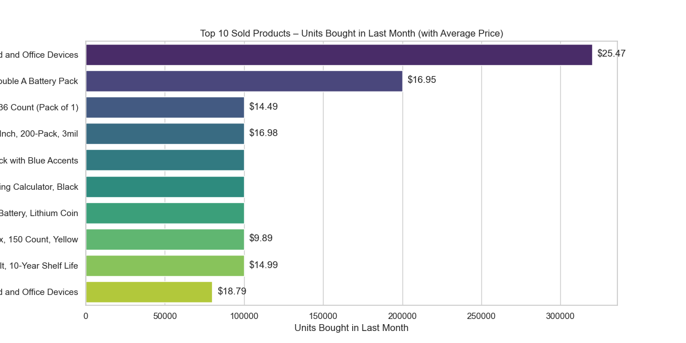
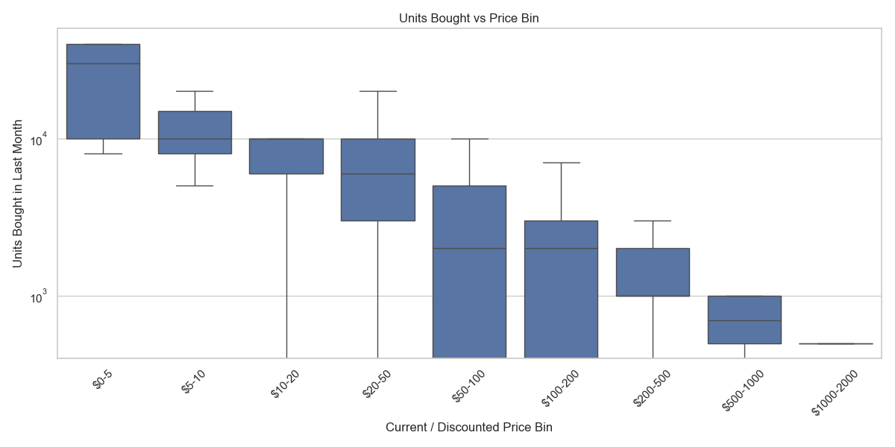
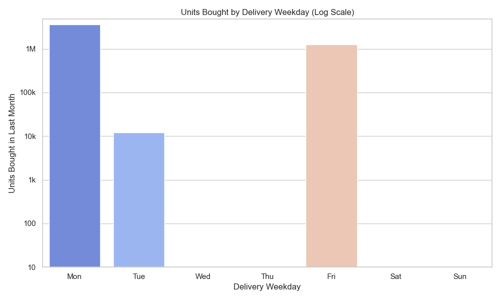
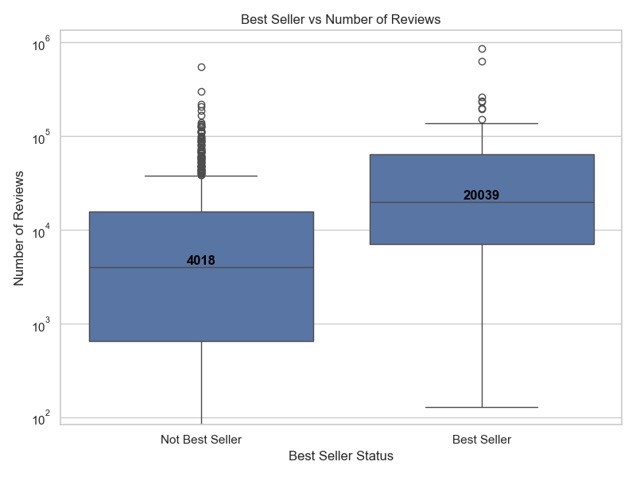
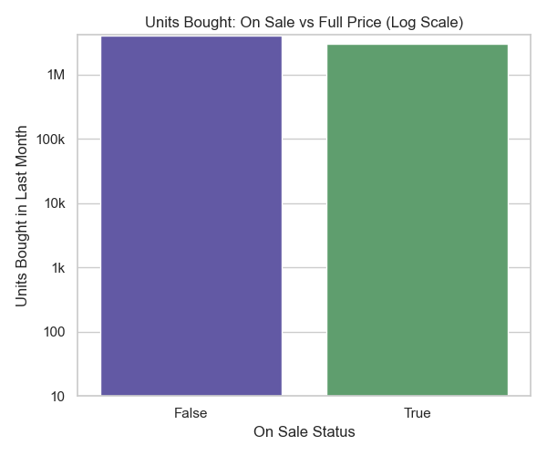
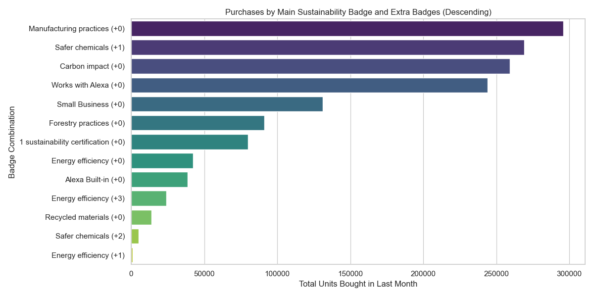

# Amazon Products Analysis 🛒

## Key Insights
- **Top Selling Products:** Batteries, calculators, and office supplies dominate; a few items skew total sales upward.
- **Price vs Units Bought:** Most purchases occur for products priced $0–$20; higher-priced items sell far less.
- **Delivery Trends:** Mondays see the highest delivery volumes, followed by Fridays.
- **Reviews vs Units Bought:** Moderate positive correlation (Pearson = 0.46); more reviews generally indicate higher sales.
- **Best Sellers:** Attract more reviews and show higher engagement than non-Best Sellers.
- **On Sale vs Full Price:** On-sale items have slightly higher median units sold (5,000 vs 3,000), indicating strategic discounting.
- **Sustainability Badges:** Products with strong or multiple sustainability badges (Manufacturing Practices, Safer Chemicals) drive higher sales.

## Project Overview
This project explores and cleans an **Amazon products sales dataset** (42k items) to prepare it for analysis. The focus is on **data cleaning, normalization, and parsing complex fields** such as price, reviews, delivery details, and sustainability badges.

The project is a hands-on exercise for learning **Pandas, regex parsing, and Jupyter notebooks**, intended to demonstrate skills relevant for a data analyst role.

## Dataset
- Original dataset: [Kaggle - Amazon Products Sales](https://www.kaggle.com/datasets/ikramshah512/amazon-products-sales-dataset-42k-items-2025)
- Only a **sample dataset** is included in this repository for GitHub use.

## Project Structure
amazon_product_analysis/
├── data/ # Sample dataset
├── images/ # Charts & screenshots
└── notebooks/ # Jupyter notebooks
└── 01_data_cleaning.ipynb

## Steps Performed
1. **Download & load dataset** using KaggleHub.
2. **Normalize numeric fields**:
   - Ratings → float
   - Number of reviews → int
   - Bought in last month → parsed into integers
   - Prices (current, listed, variant) → float
3. **Convert categorical fields**:
   - Best seller / Sponsored → Boolean
4. **Parse coupon values**
5. **Extract delivery information**:
   - Delivery cost
   - Free delivery / fastest delivery
   - Estimated & fastest delivery dates
   - Weekday
6. **Clean sustainability badges**
7. **Convert collected_at column to datetime**
8. **Save cleaned dataset**:
   - Full dataset (local only)
   - Sample dataset for GitHub

## Tools & Libraries
- Python 3.13.5
- Pandas
- NumPy
- Regex
- Jupyter Notebook
- Matplotlib
- Seaborn

## Example Visualizations
  
  
  
  
  


## How to Run

```powershell
# 1. Clone this repository
git clone https://github.com/dahhyunseo/amazon_product_analysis.git
cd amazon_product_analysis

# 2. Create a virtual environment and activate it
python -m venv venv
# Windows
.\venv\Scripts\activate
# Mac/Linux
source venv/bin/activate

# 3. Install required packages
pip install -r requirements.txt

# 4. Open Jupyter notebooks
jupyter notebook

# 5. Run the notebooks in order, starting with 01_data_cleaning.ipynb
```


